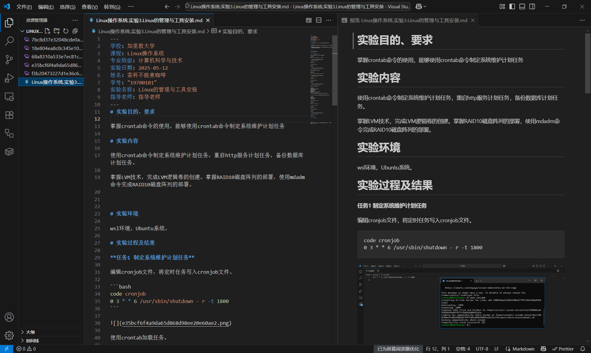
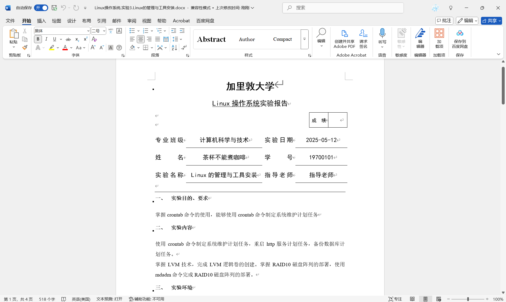

# md4report

Markdown For Report，让学生专注于写作markdown内容，让代码负责排版、样式，自动导出为实验报告、课程设计报告等文件。彻底拜托富文本编辑器过于复杂的编辑功能。

md4report是一款 Markdown 转 DOCX 的自动化转换工具，通过 pandoc 实现基础格式转换，结合 pyyaml 读取元数据，使用python-docx 定制学校页眉页
脚、学生信息栏等个性化样式，解决 pandoc 无法处理的院校模板适配问题。

## 使用

### 效果

markdown格式的原文件



导出后的docx格式的实验报告



### 使用方法

根据所用模板的要求，在文章开头添加metadata。例如下面这段

```yaml
---
学校: 加里敦大学
课程: Linux操作系统
专业班级: 计算机科学与技术
实验日期: 2025-05-12
姓名: 茶杯不能煮咖啡
学号: "19700101"
实验名称: Linux的管理与工具安装
指导老师: 指导老师
---
```

m4r会读取所需数据，并传参给python-docx插入标题。

最后，记下文件所在路径，通过命令行进行调用。

```bash
python3 m4r.py "path/to/your/markdown-file.md"
```
